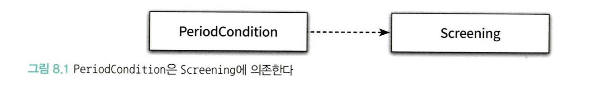

# chapter 8

> 협력을 위해 필요한 의존성은 유지하되, 변경을 방해하는 의존성은 제거한다.
>

---

# Dependency

> 어떤 객체가 협력하기 위해 다른 객체를 가질 때, 두 객체 사이에 의존성이 존재한다고 볼 수 있다.
>
- 의존성은 실행 시점과 구현 시점에 다른 의미를 가진다.
    - 실행 시점: 의존하는 개체가 정상적으로 동작하기 위해선, 실행 시에 의존 대상 객체가 반드시 존재해야 한다.
    - 구현 시점: 의존 대상 객체가 변경될 경우, 의존하는 객체도 함께 변경된다.

## Example: Dependency

```tsx
class PeriodCondition implements DiscountCondition {
	private dayOfWeek: Date;
	private startTime: Date;
	private endTime: Date;
	
	public isSatisfiedBy(screening: Screening): boolean {
		return (
			(screening.getStartTime().getDayOfWeek() === this.dayOfWeek) &&
			(this.startTime < screening.getStartTime()) &&
			(this.endTime > screening.getEndTime()
		);
	}
}
```

- 만약 실행 시점에서 `isSatisfiedBy` 라는 method 의 arguments 로 주어지는 `screening` 이란 이름의 `Screening` instance 가 존재하지 않는다면, 혹은 존재하나 `getStartTime` 등으로 전달되는 message 를 이해할 수 없다면, 해당 method 는 예상하는 대로 동작하지 않을 것이다.
- 이런 식으로 예정된 작업을 정상적으로 수행하기 위해 다른 객체를 필요로 하는 경우, 두 객체 사이에 의존성이 존재한다고 표현할 수 있다.



- 의존성은 방향성을 가지며, 그 방향은 항상 단방향이다.
- `PeriodCondition` 은 `Screening` 에 의존하고 있기에, dependency graph 를 나타낸다면 이렇게 나타낼 수 있을 것이다.


- `DiscountCondition` 이라는 interface 와 dependency inversion 으로 끌어올려진, 해당 interface 에 맞추어 구현된 (`implements`) `PeriodCondition` 의 관점에서 보자면 저런 식으로 의존성의 방향이 단방향성이지만, 기존 의존성과는 다른 모습을 볼 수 있다.
- 또한, `Screening` 과 `DayOfWeek`, `LocalTime` (TypeScript 에서는 `Date` object 가 이용되지만) 도 구분이 될 수 있다. Screening 은 method 의 parameter(argument) 로서의 dependency, `DayOfWeek`, `LocalTime` 은 property 로서의 dependency 이다.

---

# Transitive Dependency

- 이전에 구현했던 `Screening` 은 사실 `Movie`, `Customer` 등의 또 다른 class 에 의존하고 있다. `PeriodCondition` 은 이 `Screening` 에 의존하고 있다. 즉, `PeriodCondition` 또한 `Movie`, `Customer` 에 의존하고 있다. A 라는 것이 B 에 의존하면, A는 B가 의존하는 C, D... 등에도 의존성을 가지게 되는 상황, 즉 의존성의 전파가 이뤄진다. 물론 직접적으로는 아니고, 간접적으로.


## Direct Dependency

- `PeriodCondition` 이 `Screening` 에 의존하는 것처럼, 의존관계가 명시적으로 드러나 직접적으로 의존하는 경우를 직접 의존성, Direct Dependency 라고 한다.

## Indirect Dependency

- 그와 다르게, `PeriodCondition` 이 Screening 에 의존하면서 Screening 이 의존하는 `Movie` 에 의존하게 되는 경우는 간접 의존성, Indirect Dependency 라고 한다.

## Boundary of the concept of dependency

- 여기서 의존성은 class 를 기반으로 한 의존성을 위주로 다루었지만, 사실 의존성이 형성될 수 있는 대상은 class 에만 국한되어있지 않다. module 이 될 수도 있고, 혹은 별도로 분리된 system 일 수도 있다.

## But, the core concept of dependency is not changed

- 그럼에도 불구하고 의존성이라는 개념의 기본은 변하지 않는다. ‘의존하고 있는 대상의 변경에 영향을 받을 수 있는 가능성' 을 의존성이라고 한다.

---


# Runtime dependency vs Compile time dependency

## Definition

### Runtime

- application 이 실행되는 시점을 의미한다.

### Compile time

- 작성된 코드가 컴파일 되는 시점을 가리키지만, 사실 문맥에 따라서는 코드 그 자체를 가리키기도 한다.
- 시간보다는 우리가 작성한 코드에 좀 더 초점을 맞춘다.
- 그리고 JavaScript, Python 같은 경우엔 compile 이라는 과정이 존재하지 않기도 하기에 작성된 코드가 컴파일 되는 시점 보다는 그냥 코드 그 자체로 이해하는 편이 좋다.

### Example

```tsx
//------------------------compile time-------------------------------//
// example.ts
class SomeClass {
	constructor(
		private readonly depdencyClass: DependencyClass,
	)
	//...
}

class ConcreteDependencyClass implements DependencyClass {
	//...
}

interface DepdencyClass {
	//...
}

new SomeClass(new ConcreteDependencyClass());

//----------------------------runtime--------------------------//

node example.ts
```

## Runtime dependency ≠ Compile time dependency

- 핵심은 이 두 의존성이 다르다는 이야기이다. 정확히 말하면, 유연하고 재사용 가능한 코드를 설계하기 위해서는 두 종류의 의존성이 달라야 한다.


- 이전에 설계한 영화 예매 application 을 가지고 compile time / runtime dependency 에 대해서 이야기해보자.
- 먼저, runtime dependency 는 알 수 가 없다. 정확히 말하면, 어떤 의존성이 끌어올려지느냐에 따라 달라질 수 있다.
- 동시에, compile time dependency 도 알 수 가 없다. 정확히 말하면, concrete class 가 아니라 interface 에 의존하고 있기 때문에 어떤 concrete depdency 에 의존하는지 말할 수 없고 그저 interface 에 의존한다고만 이야기 할 수 있는 것이다.
- 어떤 클래스가 다양한 클래스의 인스턴스와 협력하기 위해서는 협력한 인스턴스의 구체적인 클래스를 알아선 안 된다. 연결 자체는 runtime 에서 진행해주고, concrete class 가 아닌 interface 라는 추상적인 것에 의존하도록 설계하자.

---

# How to map and resolve the runtime / compile time dependency?

- 일단 위에 나온 것처럼 유연한 설계를 위해 runtime dependency 와 compile time dependency 를 별도로 분리해 내는 것은 좋았다. 그렇다면, 어떻게 이 둘을 엮어낼 것인가?
- 일단 해당 방법은 의존성 해결(Resolving the dependency) 라고 명명한다. 그리고 이 의존성 해결을 위한 방법은 크게 3가지가 존재한다.
    - 객체를 생성하는 시점에 `constructor` 를 통해 의존성을 해결한다 - `dependency injection`
    - 객체 생성 후 `setter` method 를 통해 의존성을 해결한다 - `strategy`
    - 객체의 메서드를 실행할 때 arguments  를 통해서 의존성을 해결한다
- 위의 두 개는 어떻게 객체의 의존성의 생애 주기를 관리할 것이냐에 따라 달라지는데, 해당 책에서는 다 만들어 놓은 뒤 필요할 때 필요한 것들을 사용할 수 있게 하는 것을 추천한다.
- 물론 저걸 객체의 전역적인 의존성으로 들고 있을 필요가 없고, 특정 method 실행 시에만 알아도 된다면 method arguments 로 넘겨주는 것도 해결 방법이다.

---

# Flexible structure

> 객체 지향 프로그래밍은 객체 간의 협력이 핵심이다. 그렇기에, 필요한 만큼의 의존성은 존재할 수 밖에 없다. 그러나, 필요한 것보다 과한 의존성은 문제가 될 수 있다.
>
- 위에서 `PercentDiscountPolicy` 나 `AmountDiscountPolicy` 라는, concrete class 에 의존을 하는 상황은 유연하지 않은 설계를 만든다. 각 concrete class 에 변경이 일어나는 경우, 그 concrete class 에 의존하는 class 들은 그 변경사항을 전부 알아야 할 수 밖에 없기 때문에 설계에 그 변경을 고려할 수 밖에 없고 의존성의 전파가 일어나게 된다.
- 그렇기에 그 둘을 묶어줄 수 있는 interface 인 `DiscountPolicy` 에 의존하게끔 만들어서, 의존성을 interface level 에서 막아낼 수 있게끔 막아준다.
- 핵심은 의존성의 존재 여부가 아니라, 의존성의 정도이다. 어떠한 의존성이 다양한 환경에서 클래스를 재사용 할 수 없도록 제한한다면 그 의존성은 바람직하지 못한 것이다.

## Acknowledge makes coupling harder

> 서로에 대해 알고있는 지식의 양이 결합도를 결정한다
>
- `Movie` 가 `PercentDiscountPolicy` 에 의존하고 있다고 생각해보자, 이렇게 되는 경우 Movie 는 퍼센트로 계산하는 할인 정책에 의존한다는 사실을 코드를 작성하는 우리가 보아도 알 수 있다. Movie 또한 마찬가지일 것이다.
- 그러나, 저런 concrete class 가 아니라 `DiscountPolicy` 라는 interface 에 의존한다면? 코드를 작성하는 사람도, Movie 라는 객체도 어떤 DiscountPolicy 인지를 알 수가 없다. 그래서 DiscountPolicy 가 조금 더 자율적으로 행동할 수 있게 된다.  어떤 message 에 대한 응답만 잘 해 낸다면, DiscountPolicy 는 재량껏 할인 정책을 표현할 수 있게 된다.
- 첫 번째 bulletpoint 는 많이 아는 만큼 의존관계가 뚜렷해진다. 반면 두 번째 bulletpoint 는 많이 알지 못 하기에 의존관계가 느슨해진다.

---