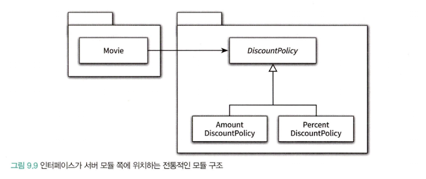
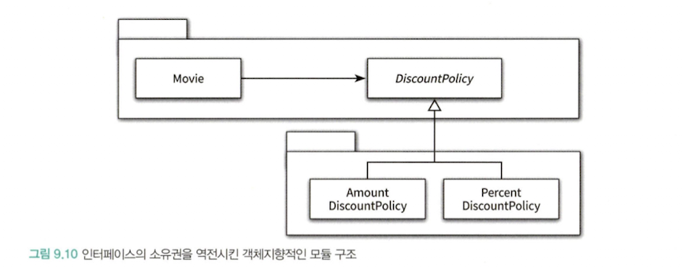

# chapter-09

> 여기서 주의할 점은 추상화를 했다고 해서, 모든 수정에 대해 설계가 폐쇄되는 것은 아니라는 것이다. 수정에 대해 닫혀있고 확장에 대해 열려있는 설계는 공짜로 얻어지지 않는다.
>
- Open-Closed Principle, so called `OCP` is related with the dependency, compile time dependency and runtime dependency.
    - If these dependencies are not same, we can ‘replace’ them to other one without modifying exist thing.

# Separate use from creation

## Process to separate

> 소프트웨어 시스템은 응용 프로그램을 제작하고 의존성을 서로 연결하는 시작 단계와 시작 단계 이후에 이어지는 실행 단계를 분리해야 한다.
>

```tsx
class Movie {
	// ...
	private discountPolicy: DiscountPolicy;
	constructor() {
		// create
		this.discountPolicy = new AmountDiscountPolicy(...);
	}
	// use
	public calculateMovieFee(screening: Screening): Money {
		return fee.minus(discountPolicy.calculateDiscountAmount(screening);
	}
}
```

- There is no problem that creating a specific instance in specific object. And also, there is no problem that sending a message to non-specific(abstract class, interface, what else) object in specific instance.
- But, when these are occurred in same object, this is not a good design.

```tsx
class Movie {
	constructor(
		// ...
		private discountPolicy: DiscountPolicy,
	) {}
	// use
	public calculateMovieFee(screening: Screening): Money {
		return fee.minus(discountPolicy.calculateDiscountAmount(screening);
	}
}

// ------------------------------------------------------------------------ //

// create
class Client {
	public getAvatarFee() {
		const avatar = new Movie("아바타", Duration.ofMinutes(120), Money.wons(10000), ...);
		return avatar.getFee();
	}
}
```

- Separate use from creation

## Using Factory

```tsx
// Factory Class
class Factory {
	public createAvatarMovie(): Movie {
		return new Movie(
			"아바타",
			Duration.ofMinutes(120),
			// ...
	}
}

// ------------------------------------------------------------------------ //

class Client {
	constructor(
		private readonly factory: Factory
	) {}
	
	public getAvatarFee() {
		const avatar = this.factory.createAvatarMovie();
		return avatar.getFee();
	}
}
```

- We separate use from creation, but this design allow client be related with some specific contexts.
- If we want to separate the client from specific contexts also, use `Factory` object.
    - This object just create instance, so `Client` object doesn’t know the contexts.

# Assigning role - Pure fabrication and types of decomposition

> 그러나 종종 도메인 개념을 표현하는 객체에게 책임을 할당하는 것만으로는 (소프트웨어의 설계가) 부족한 경우가 발생한다. 도메인 모델은 설계를 위한 중요한 출발점이지만, 단지 출발점이라는 사실을 명심해야 한다. 실제로 동작하는 애플리케이션은 데이터베이스 접근을 위한 객체와 같이 도메인 개념을 초월하는 기계적인 개념들을 필요로 할 수 있다.
>

> 모든 책임을 도메인 객체에게 할당하면 낮은 응집도, 높은 결합도, 재사용성 저하와 같은 심각한 문제점에 봉착하게 될 가능성이 높아진다. 이 경우, 도메인 개념을 표현한 객체가 아닌 설계자가 편의를 위해 임의로 만ㄷ르어낸 가공의 객체에게 책임을 할당해서 문제를 해결해야 한다. 크레이그 라만은 이처럼 책임을 할당하기 위해 창조되는 도메인과 무관한 인공적인 객체를 `Pure Fabrication` 이라고 부른다.
>

> 객체 지향이 실세계의 모방이라는 말은 옳지 않다. 객체지향 애플리케이션은 도메인 개념 뿐만 아니라, 설계자들이 임의로 창조한 인공적인 추상화들을 포함하고 있다. 애플리케이션 내에서 인공적으로 창조한 객체들이 도메인 개념을 반영하는 객체들보다 오히려 더 많은 비중을 차지하는 것이 일반적이다.
>

> 객체지향 애플리케이션 대부분은 실제 도메인에서는 발견할 수 없는 순수한 인공물들로 가득 차있다. 이것은 현대적인 도시가 자연물보다는 건물이나 도로와 같은 인공물로 가득 차있는 것과 유사하다. 도시의 본질은 그 안에 뿌리를 내리고 살아가는 자연과 인간에게 있지만, 도시의 대부분은 인간의 생활을 편리하게 만들기 위한 수많은 인공물들로 채워져 있다.
>

> 도메인 모델에서 출발해서 설계에 유연성을 추가하기 위해 책임을 이리저리 옮기다 보면, 많은 Pure fabrication 을 추가하게 된다는 사실을 알게 될 것이다. Factory 는 객체의 생성 책임을 할당할 만한 도메인 객체가 존재하지 않을 때 선택할 수 있는 Pure fabrication 이다. 14장에서 살펴 보겠지만, 대부분의 디자인 패턴은 Pure fabrication 을 포함한다.
>

## Remember: Information expert

- When we assign a role to some specific object, we should assign the expert(which knows much more information than other objects).

## Representational decomposition

- Decompose a system by objects representing the real world object or concept in domain.
- It follows the relations and concepts in domain model and try to minimize the difference between domain and software.

## Behavioral decomposition

- To make smaller the roles of domain objects for avoiding the issue (lower composition, higher coupling, and lower reusability), create a `Pure Fabrication` object which doesn’t related with domain model.

# Dependency Injection

- If an object that use some dependencies does not create and just handed over from outside, we called this pattern to `Dependency Injection` pattern.

## Types of dependency injection

### Constructor Injection

```tsx
class SomeClass {
	constructor(
		private readonly someDependency: SomeClass,
	) {}
}
```

- Got dependencies when an object is created using `constructor`

### Setter Injection and it’s pros and cons

```tsx
class SomeClass {
	private someDependency: SomeDependency;

	public setSomeDependency(someOtherDependency: SomeDependency): void {
		this.someDependency = someOtherDependency;
	}
}
```

- Got dependencies using `setter` method after create an instance
- Pros and cons
    - Pros
        - Can change dependencies in runtime via setter method.
    - Cons
        - Using some dependency without using this setter method, an error is occured.

### Method Injection

```tsx
const someClass = new SomeClass();
someClass.someMethod(argumentOne, new SomeDependencies(...));
```

- Got dependencies using specific method’s argument (parameter)

## Service locator pattern

- `service locator` is an object holding dependencies.
- When an object needed some dependency, require the dependency to service locator object.

```tsx
class Movie {
	private discountPolicy: DiscountPolicy;
	constructor(
		title: string,
		runningTime: Duration,
		fee: Money,
	) {
		this.title = title;
		this.fee = fee;
		this.runningTime = runningTime;
		this.discountPolicy = ServiceLocator.discountPolicy();
	}
}
```

```tsx
class ServiceLocator {
	private static discountPolicy: DiscountPolicy;
	
	public static discountPolicy(): DiscountPolicy {
		return this.discountPolicy;
	}
	
	public static provide(discountPolicy: DiscountPolicy): void {
		this.discountPolicy = discountPolicy;
	}
}
```

- If `Movie` class want to depend on `AmountPolicy` instance, set this instance to service locator object.

```tsx
ServiceLocator.provide(new AmountPolicy(...));
const avatar = new Movie("아바타", Duration.ofMinutes(120), Money.wons(10000));
```

## Cons of service locator pattern

> 캡슐화는 코드를 읽고 이해하는 행위와 관련이 있다. 클래스의 퍼블릭 인터페이스만으로 사용 방법을 이해할 수 있는 코드가 캡슐화의 관점에서 훌륭한 코드이다. 클래스의 사용법을 익히기 위해 구현 내부를 샅샅히 뒤져야 한다면, 그 클래스의 캡슐화는 무너진 것이다.
>

> 가능하다면 의존성을 명시적으로 표현할 수 있는 기법을 사용하라. 의존성 주입은 의존성을 명시적으로 명시할 수 있는 방법 중 하나일 뿐이다. 요점은 명시적인 의존성에 초점을 맞추는 것이다. 그리고 이 방법이 유연성을 향상 시키는 가장 효과적인 방법이다.
>
- Simple, it hide dependencies. We can’t find what type of object is used as dependency.
- And it makes hard to test. Every unit test cases shouldn’t get affect from other test but using this pattern they are tangled.

# Dependency inversion policy

> 의존성은 변경의 전파와 관련된 것이기 때문에, 설계는 변경의 영향을 최소화 하도록 의존성을 관리해야 한다.
>

> 중요한 것은 상위 수준의 클래스이다. 상위 수준의 변경에 의해 하위 수준이 변경되는 건 납득할 수 있지만, 하위 수준의 변경으로 인해 상위 수준이 변경되어서는 곤란하다. 하위 수준의 문제로 인해 상위 수준의 클래스들을 재사용 하는 것이 어렵다면, 이것 역시 문제가 된다.
>

```tsx
class Movie {
	private amountDiscountPolicy: DiscountPolicy;
	// ...
}
```

- When we design the `Movie` object like this, this class is fragile to changes because the `amountPolicy`, the dependency of Movie class, is concrete.


- Like this dependency flow, the flow concrete dependency inversed. The `Movie` object just depends on `DiscountPolicy` interface and appropriate concrete class, like `AmountDiscountPolicy`, injected in runtime.

## Package and dependency inversion



- This is a traditional structure of module.
- When some parts of `DiscountPolicy` module are changed, the whole module compiled or re-compiled, the whole `DiscountPolicy` module.
    - Although Only `AmountDiscountPolicy` is changed and PercentDiscountPolicy is not changed, the whole module should be re-compiled.



- To solve this problem, the `Movie` and `DiscountPolicy` located at same module.
- And the `Movie` get appropriate concrete class in runtime via interface with inversed dependency graph.
- We call this pattern as `Interface Segregation` pattern (I of SOLID).

---

# Tips for flexibility

## 유연한 설계는 유연성이 필요할 때만 옳다.

> 유연하고 재사용 가능한 설계가 항상 좋은 것은 아니다. 설계의 미덕은 단순함과 명확함으로부터 나온다. 단순하고 명확한 설계를 가진 코드는 읽기 쉽고 이해하기도 편하다. 유연한 설계는 이와 다른 길을 걷는다. 변경하기 쉽고 확장하기 쉬운 구조를 만들기 위해선 단순함과 명확함의 미덕을 버리게 될 가능성이 높다.
>

> 유연성은 항상 복잡성을 수반한다. 유연하지 않은 설계는 단순하고 명확하다. 유연한 설계는 복잡하고 암시적이다.
>

> 불필요한 유연성은 불필요한 복잡성을 낳는다. 단순하고 명확한 해법이 그런대로 만족스럽다면 유연성을 제거하라. 유연성은 코드를 읽는 사람들이 복잡성을 수용할 수 있을 때만 가치가 있다.
>

## 협력과 책임이 중요하다.

> 지금까지 클래스를 중심으로 구현 매커니즘 관점에서 의존성을 설명했지만, 설계를 유연하게 만들기 위해서는 협력에 참여하는 객체가 다른 객체에게 어떤 메시지를 전송하는지가 중요하다. `Movie` 가 다양한 할인 정책과 협력할 수 있는 이유는 무엇인가? 모든 할인 정책이 Movie 가 전송하는 `calculateDiscountAmount` message 를 이해할 수 있기 때문이다. 이들 모두 요금을 계산하기 위한 협력에 참여하면서 할인 요금을 계산하는 책임을 수행할 수 있고, Movie 의 입장에서 동일한 역할을 수행할 수 있다.
>

> 설계를 유연하게 만들기 위해서는 먼저 역할, 책임, 협력에 초점을 맞춰야 한다. 다양한 맥락에서 협력을 재사용할 필요가 없다면 설계를 유연하게 만들 당위성도 사라진다. 객체들이 메시지 전송자의 관점에서 동일한 책임을 수행하는지 여부를 판단할 수 없다면, 공통의 추상화를 도출할 수 없다. 동일한 역할을 통해 객체들을 대체 가능하게 만들지 않았다면, 협력에 참여하는 객체들을 교체할 필요가 없다.
>